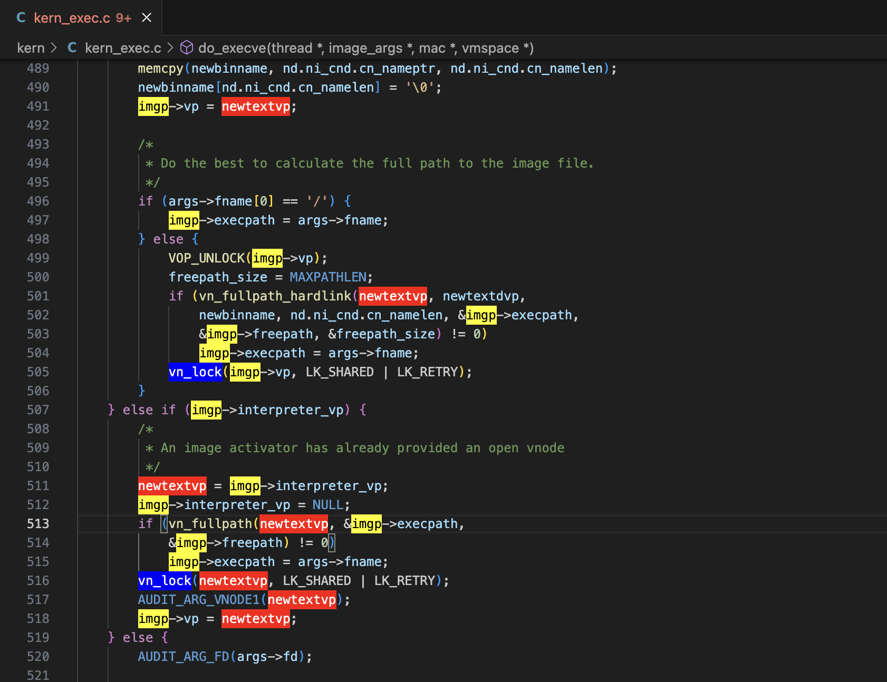

# Multi-Highlight for VS Code


Multi-Highlight is a Visual Studio Code extension for highlighting multiple
words with different and customisable colours.  It's designed to help keep track
of multiple variables while auditing or understanding code.

## Example

See the following screenshot in which I've highlighted three different words to
help clarify their use in the function being analysed:



## Commands

Multi-Highlight adds the following commands to the command palette:

- Multi-Highlight: Add Highlight
- Multi-Highlight: Remove Highlight
- Multi-Highlight: Clear Highlights

Add and Remove operate on the word currently under the cursor.

## Configuration

To configure the highlight colours, edit the `multi-highlight.colours` string.
This is a comma-separated list of background/foreground pairs.

The default list of colours is:

- yellow:black
- blue:white
- red:white
- green:white
- purple:white
- orange:white

Colours can be specified by name or using HTML syntax: `#d0d0d0`.

## Key Bindings

Multi-Highlight doesn't come with default key bindings, but I personally use the
following in my `settings.json` with
[VSCodeVim](https://github.com/VSCodeVim/Vim) to mimic
[vim-highlighter](https://github.com/azabiong/vim-highlighter):

```json
{
    "vim.normalModeKeyBindings": [
        {
            "before": ["g", "<cr>"],
            "commands": ["multi-highlight.addHighlight"]
        },
        {
            "before": ["g", "<bs>"],
            "commands": ["multi-highlight.removeHighlight"]
        },
        {
            "before": ["g", "<C-l>"],
            "commands": ["multi-highlight.clearHighlights"]
        }
    ]
}
```

## Thanks

- Thanks to [vim-highlighter](https://github.com/azabiong/vim-highlighter) for
  the inspiration.  I use this a lot in vim.
- Thanks to DALL-E 3 for generating the icon/logo.
